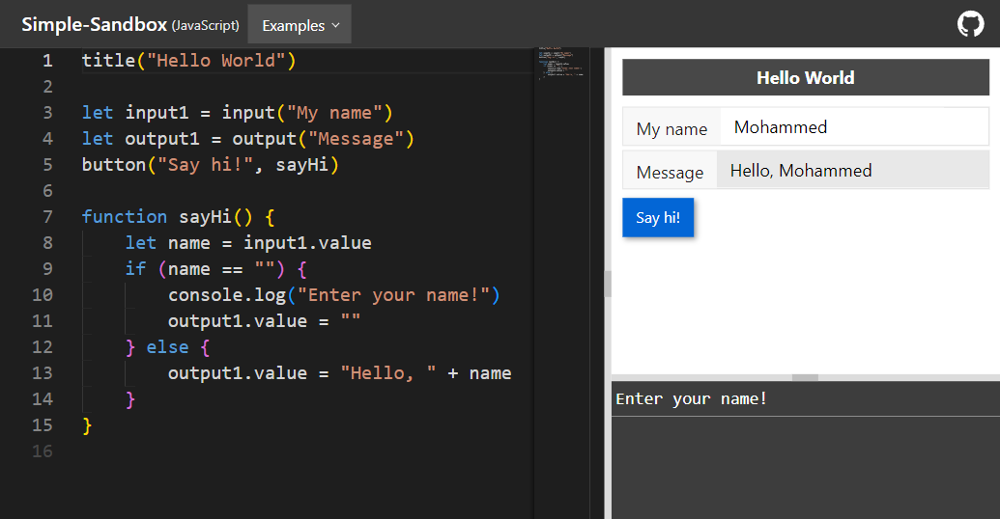

# Simple-Sandbox

A simple sandbox for learning JavaScript with basic UI controls

https://mmghv.github.io/Simple-Sandbox



---

The main goal of this tool is to provide the student with a simple coding sandbox equipped with a small set of basic UI controls that can be utilized from JavaScript, It enables the learner to focus on fundamental language concepts while connecting these concepts to user interfaces that make sense and not only logging to the console.

## Who is this for

This is intended for absolute beginners who wish to start learning programming with JavaScript directly without needing to go through HTML and CSS first. even if they know HTML it's better to understand the fundamentals first before learning DOM manipulation.

## Supported UI controls

### Basic controls

Available basic controls are (title, input, output & button) :

```js
// Add title bar
title("Page Title")

// Add empty input field
let input1 = input()

// Add input field with title and initial value
let input2 = input("Input title", "Input value")

// Add input of type number (value returns a number and not a string)
let input3 = input("Number input").number()

// Add output field
let output1 = output("Output title")

// Get input value
console.log(input2.value)

// Set output (or input) value
output1.value = "Output value"

// Add button
button("Click me!", click)

// Button click callback function
function click() {
    input1.value = "Button clicked!"
    input3.value = input3.value + 1
    console.log("Button clicked!")
}
```

### Advanced controls

A more advanced table control is available which is ideal for learning loops and working with dynamic lists (Arrays and Objects could also be used).

A full example of working with the table can be found [here](https://mmghv.github.io/Simple-Sandbox/index.html?example=table).

### Other methods & tools

`rtl()` and `ltr()` functions can be used to change the page direction to right-to-left and left-to-right respectively.

## Saving and sharing your code

Currently, there's no backend or a login system, but a simple system to save and share your code is implemented in the frontend using the URL, when you edit the code the URL will change automatically, the whole code will be compressed and encoded into the URL so you can bookmark it or send the link to someone else.

## TODO

- [x] Add other UI controls (like tables & lists that can be used with arrays and loops).
- [x] Allow saving & sharing code via links.
- [ ] short links.
- [x] Make the layout mobile-friendly.
- [ ] Add the ability to control the layout.
- [ ] Build a desktop version for offline use
- [ ] Add Dark/Light mode switch.

Please feel free to suggest or contribute enhancements that may benefit the beginners.

## License

Copyright © 2023 [Mohamed Gharib](https://github.com/mmghv), Released under the [MIT license](LICENSE).